## Embrix O2X – High-Level ERD Overview

**Version**: 3.1.9-SNAPSHOT  
**Last Updated**: February 2026  
**Purpose**: High-level entity–relationship overview of the Embrix O2X data model, aligned with all major services.

This document summarizes the core entities and relationships already described in `DATABASE_ARCHITECTURE_COMPLETE.md` and connects them to the services that primarily own or consume each area of the schema.

For full column-level and index details, see `DATABASE_ARCHITECTURE_COMPLETE.md`.  
For system and service inventory, see `COMPLETE_SYSTEM_OVERVIEW.md` and `COMPLETE_SYSTEM_INVENTORY.md`.

---

### 1. Domain-Level ERD (Core Entities)

The diagram below focuses on the core account, order, billing, product, and usage domains that all services are built around.

```mermaid
erDiagram

    %% Core customer & identity
    ACCOUNT {
        varchar id
        varchar account_number
        varchar account_type
        varchar status
    }

    ADDRESS {
        varchar id
        varchar address_type
    }

    USER {
        varchar id
        varchar username
        varchar email
        varchar role
        varchar status
    }

    %% Product & pricing
    PRODUCT {
        varchar id
        varchar product_code
        varchar name
        varchar product_type
        varchar status
    }

    PRICE_OFFER {
        varchar id
        varchar offer_code
        numeric price
        varchar billing_frequency
        varchar status
    }

    BUNDLE {
        varchar id
        varchar bundle_code
        varchar name
        varchar bundle_type
        varchar status
    }

    DISCOUNT {
        varchar id
        varchar discount_code
        varchar discount_type
        numeric discount_value
        varchar status
    }

    %% Orders & subscriptions
    "ORDER" {
        varchar id
        varchar order_number
        varchar order_type
        varchar status
    }

    SERVICE_LINE {
        varchar id
        varchar action
        varchar status
    }

    SUBSCRIPTION {
        varchar id
        varchar subscription_number
        varchar status
        date start_date
        date end_date
    }

    ORCHESTRATION_STATE {
        varchar id
        varchar current_step
        varchar step_status
    }

    ORDER_ACTIVITY {
        varchar id
        varchar activity_type
        varchar old_status
        varchar new_status
    }

    %% Billing, invoicing, AR
    CHARGE {
        varchar id
        varchar charge_type
        numeric amount
        numeric tax_amount
        numeric total_amount
        varchar status
    }

    INVOICE {
        varchar id
        varchar invoice_number
        date invoice_date
        date due_date
        numeric total_amount
        numeric balance
        varchar status
    }

    PAYMENT {
        varchar id
        varchar payment_number
        numeric amount
        date payment_date
        varchar payment_type
        varchar status
    }

    PAYMENT_ALLOCATION {
        varchar id
        numeric allocated_amount
        date allocation_date
    }

    BALANCE_IMPACT {
        varchar id
        varchar impact_type
        numeric amount
    }

    %% Usage & mediation
    USAGE_RECORD {
        varchar id
        date usage_date
        varchar service_type
        numeric volume
        boolean rated
        boolean billed
    }

    USAGE_ACCUMULATOR {
        varchar id
        varchar accumulator_type
        varchar accumulation_period
        numeric accumulated_value
    }

    USAGE_QUOTA {
        varchar id
        varchar quota_type
        numeric quota_limit
        varchar action_on_exceed
    }

    CDR_FILE {
        varchar id
        varchar file_name
        integer record_count
        varchar status
    }

    CDR_ERROR {
        varchar id
        integer line_number
        varchar error_type
    }

    %% Revenue recognition
    DEFERRED_REVENUE {
        varchar id
        numeric total_amount
        numeric recognized_amount
        numeric remaining_amount
        varchar recognition_method
        varchar status
    }

    JOURNAL_ENTRY {
        varchar id
        date entry_date
        varchar entry_type
        numeric amount
        boolean posted
    }

    %% Relationships – account centric
    ACCOUNT ||--o{ ADDRESS : "has"
    ACCOUNT ||--o{ USER : "has"
    ACCOUNT ||--o{ SUBSCRIPTION : "owns"
    ACCOUNT ||--o{ "ORDER" : "places"
    ACCOUNT ||--o{ INVOICE : "billed_by"
    ACCOUNT ||--o{ PAYMENT : "pays_with"
    ACCOUNT ||--o{ CHARGE : "billed_with"
    ACCOUNT ||--o{ USAGE_RECORD : "generates"
    ACCOUNT ||--o{ BALANCE_IMPACT : "balance_changes"

    %% Product & pricing relationships
    PRODUCT ||--o{ PRICE_OFFER : "priced_by"
    PRODUCT ||--o{ SERVICE_LINE : "ordered_as"
    PRODUCT ||--o{ SUBSCRIPTION : "subscribed_as"
    PRICE_OFFER ||--o{ SUBSCRIPTION : "applied_to"

    BUNDLE ||--o{ PRODUCT : "contains"
    DISCOUNT ||--o{ PRICE_OFFER : "applies_to"

    %% Order & subscription relationships
    "ORDER" ||--o{ SERVICE_LINE : "contains"
    "ORDER" ||--o{ ORDER_ACTIVITY : "logged_in"
    "ORDER" ||--|| ORCHESTRATION_STATE : "tracked_by"
    "ORDER" }o--|| ACCOUNT : "for"

    SERVICE_LINE }o--|| PRODUCT : "of_product"
    SERVICE_LINE }o--|| PRICE_OFFER : "with_pricing"

    SUBSCRIPTION }o--|| ACCOUNT : "for"
    SUBSCRIPTION }o--|| PRODUCT : "of_product"
    SUBSCRIPTION }o--|| PRICE_OFFER : "on_offer"

    %% Billing & AR relationships
    SUBSCRIPTION ||--o{ CHARGE : "generates"
    INVOICE ||--o{ CHARGE : "aggregates"
    PAYMENT ||--o{ PAYMENT_ALLOCATION : "allocated_by"
    INVOICE ||--o{ PAYMENT_ALLOCATION : "cleared_by"
    PAYMENT ||--o{ BALANCE_IMPACT : "impacts"
    CHARGE ||--o{ BALANCE_IMPACT : "impacts"

    %% Usage & mediation relationships
    SUBSCRIPTION ||--o{ USAGE_RECORD : "consumes"
    SUBSCRIPTION ||--o{ USAGE_ACCUMULATOR : "tracked_by"
    SUBSCRIPTION ||--o{ USAGE_QUOTA : "limited_by"

    CDR_FILE ||--o{ USAGE_RECORD : "produces"
    CDR_FILE ||--o{ CDR_ERROR : "has_error"

    %% Revenue recognition relationships
    CHARGE ||--|| DEFERRED_REVENUE : "defers"
    DEFERRED_REVENUE ||--o{ JOURNAL_ENTRY : "recognized_by"
```

This diagram is intentionally high-level: it focuses on the main entities and relationships you will reason about when working with Embrix O2X flows (order-to-cash, usage, billing, and revenue).

---

### 2. How Services Map to the ERD

Each service is built on top of the shared `engine` library and the PostgreSQL schemas. The table below shows which areas of the ERD each service primarily touches.

| Service / Component        | Primary Schemas           | Main Entities (from ERD)                                                                 |
|---------------------------|---------------------------|------------------------------------------------------------------------------------------|
| `service-transactional`   | `core_engine`, `core_oms` | `ACCOUNT`, `SUBSCRIPTION`, `ORDER`, `SERVICE_LINE`, `ADDRESS`, `USER`                    |
| `service-billing`         | `core_billing`, `core_usage` | `CHARGE`, `INVOICE`, `USAGE_RECORD`, `USAGE_ACCUMULATOR`, `USAGE_QUOTA`, `BALANCE_IMPACT` |
| `service-invoice`         | `core_billing`            | `INVOICE`, `CHARGE`                                                                      |
| `service-payment`         | `core_billing`            | `PAYMENT`, `PAYMENT_ALLOCATION`, `BALANCE_IMPACT`, `INVOICE`                            |
| `service-usage`           | `core_usage`              | `USAGE_RECORD`, `USAGE_ACCUMULATOR`, `USAGE_QUOTA`                                      |
| `service-mediation`       | `core_mediation`, `core_usage` | `CDR_FILE`, `CDR_ERROR`, `USAGE_RECORD`                                              |
| `service-revenue`         | `core_revenue`, `core_billing` | `DEFERRED_REVENUE`, `JOURNAL_ENTRY`, `CHARGE`, `INVOICE`                             |
| `crm_gateway`             | `core_engine`, `core_oms` | `ACCOUNT`, `ORDER`, `SERVICE_LINE`, `SUBSCRIPTION` (via GraphQL)                        |
| `provision_gateway`       | `core_oms`, `core_engine` | `ORDER`, `SERVICE_LINE`, `ORCHESTRATION_STATE`                                          |
| `payment-gateway`         | `core_billing`, `core_config` | `PAYMENT`, `PAYMENT_ALLOCATION`, gateway configuration entities                      |
| `tax-gateway`, `tax-engine` | `core_billing`, `core_pricing` | `CHARGE`, `INVOICE`, `PRODUCT`, `PRICE_OFFER`, `ADDRESS` (for tax rules)          |
| `finance-gateway`         | `core_revenue`, `core_billing` | `JOURNAL_ENTRY`, `INVOICE`, `PAYMENT`                                              |
| `ui-core`, `selfcare`, `embrix-lite`, `ui` | All (via GraphQL) | Read/write across account, order, billing, usage, and revenue entities                  |

Use this table together with the ERD when reasoning about which service you should change for a particular business requirement.

---

### 3. Tenant and Configuration Context

Embrix uses a **database-per-tenant** model. Each tenant database contains the same set of schemas and tables shown in the ERD, while cross-tenant configuration is stored centrally.

- **Per-tenant schemas**: `core_engine`, `core_oms`, `core_billing`, `core_pricing`, `core_usage`, `core_revenue`, `core_mediation`, `core_config`
- **Shared configuration** (often centralized): tenant metadata, gateway attributes, OAuth attributes, feature flags

The ERD above applies to each tenant database independently. When you see an `ACCOUNT` or `INVOICE` in one tenant, it has no direct relationship to the same entity in another tenant’s database.

---

### 4. Where to Go Next

- For column-level definitions, constraints, indexes, and partitioning details, read **`DATABASE_ARCHITECTURE_COMPLETE.md`**.
- For the full service and gateway inventory and how they interact, read **`COMPLETE_SYSTEM_OVERVIEW.md`** and **`COMPLETE_SYSTEM_INVENTORY.md`**.
- For business flows that walk these entities end-to-end (e.g., Order → Provisioning → Usage → Billing → Revenue), read **`docs/newcomer/part3-services-development`** in the newcomer documentation portal.

